# Dog App - PI Henry Bootcamp

<table>
<tr>
<td width="33%">
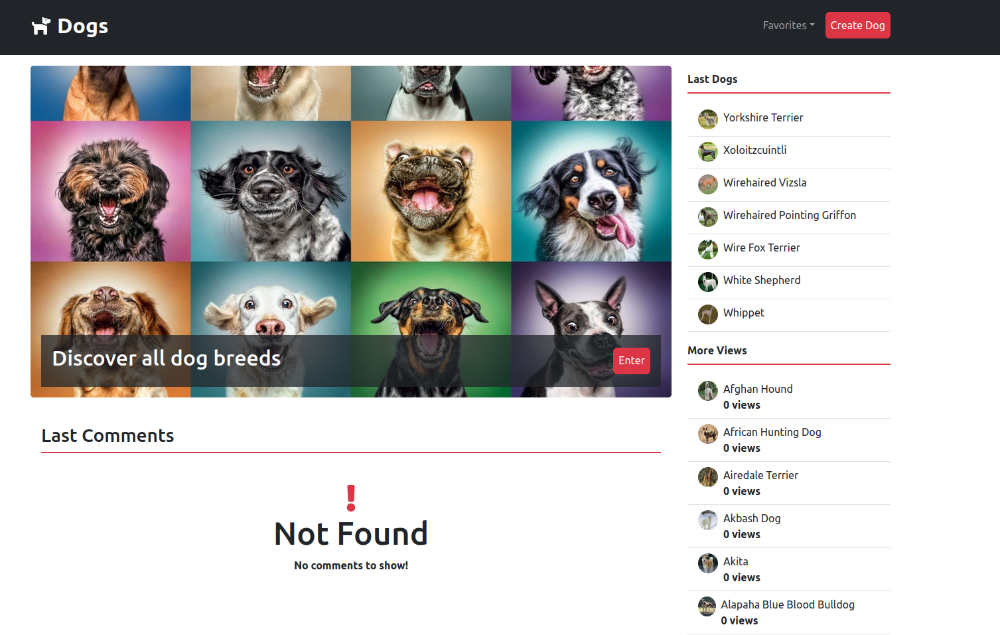
</td>
<td width="33%">
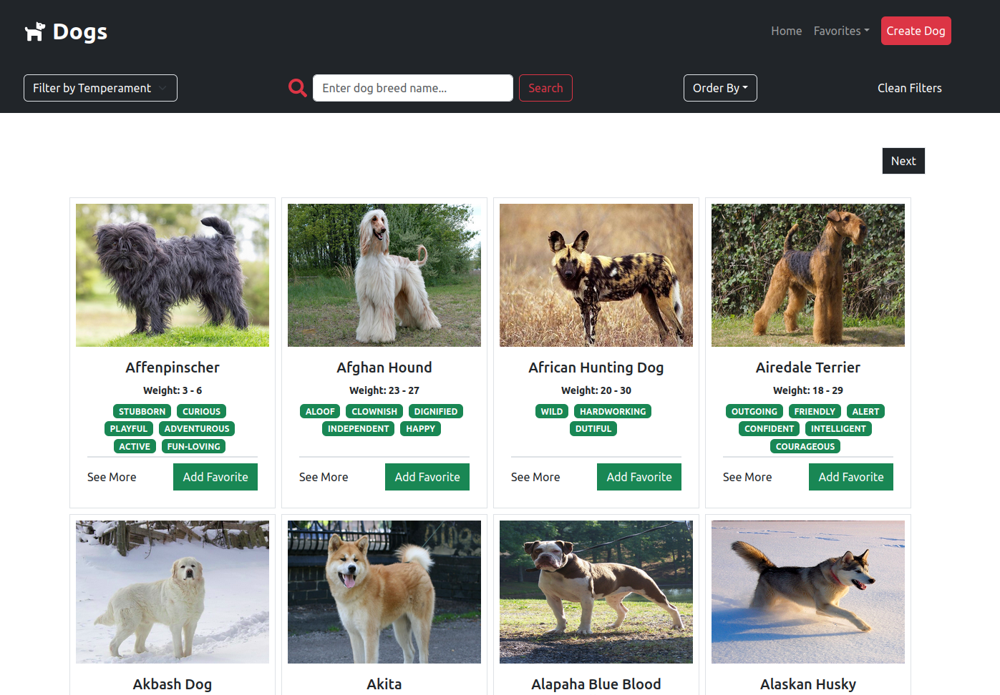
</td>
<td width="33%">
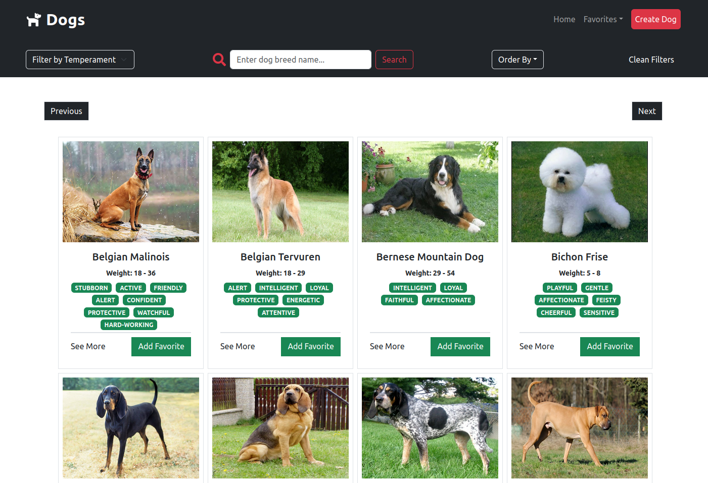
</td>
</tr>
<tr>
<td width="33%">
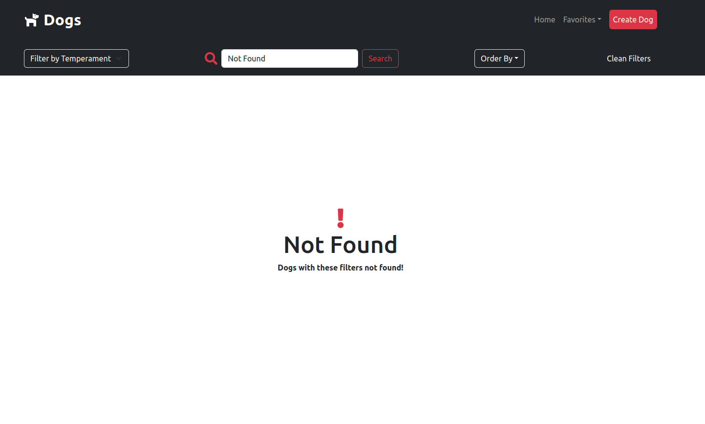
</td>
<td width="33%">
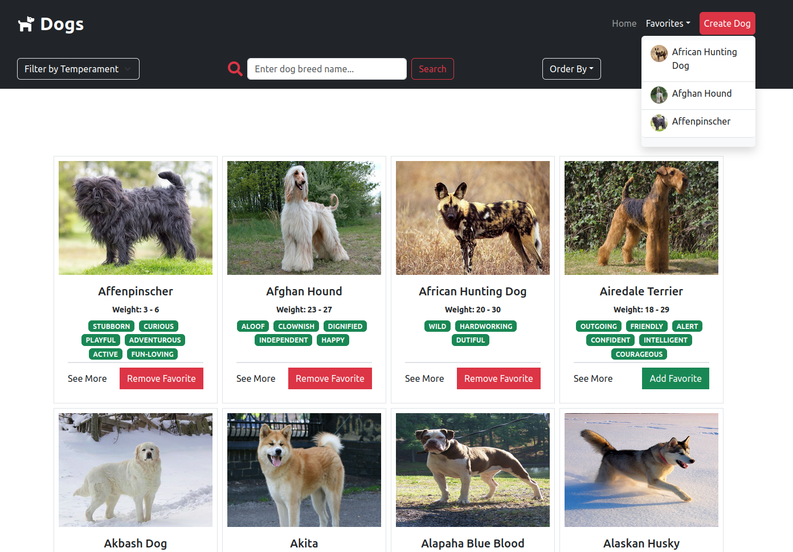
</td>
<td width="33%">
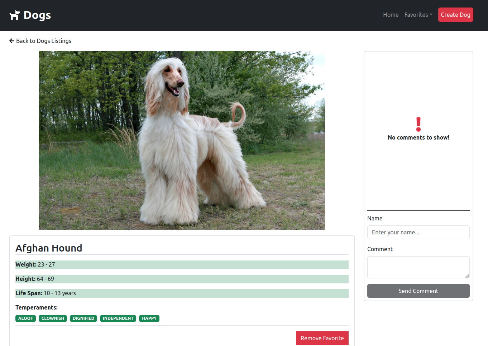
</td>
</tr>
<tr>
<td width="33%">
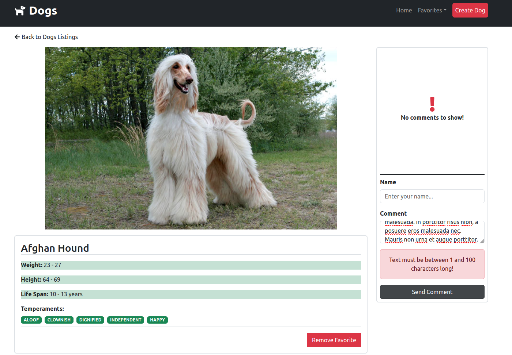
</td>
<td width="33%">
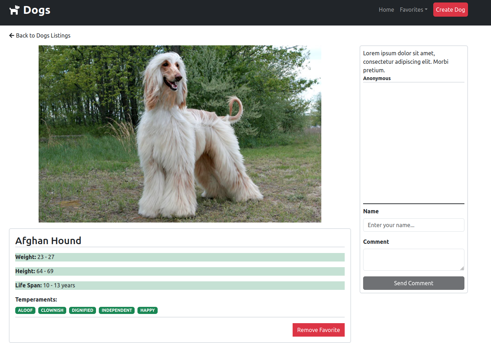
</td>
<td width="33%">
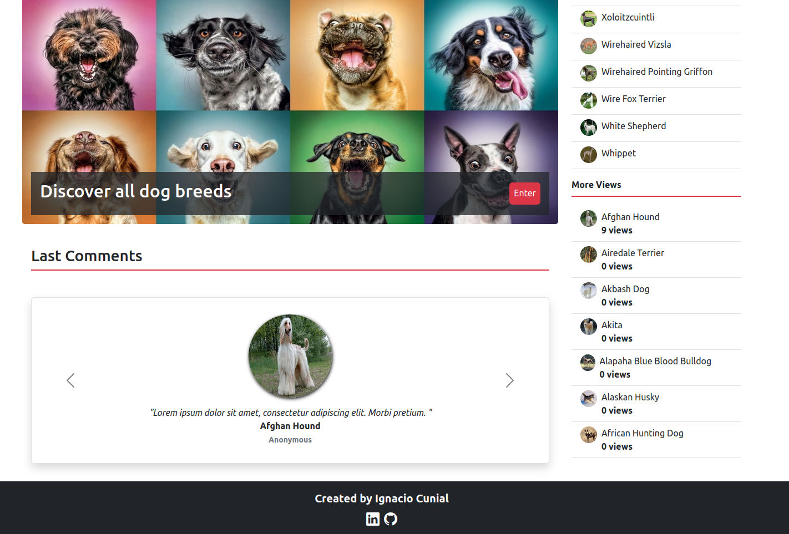
</td>
</tr>
<tr>
<td width="33%">
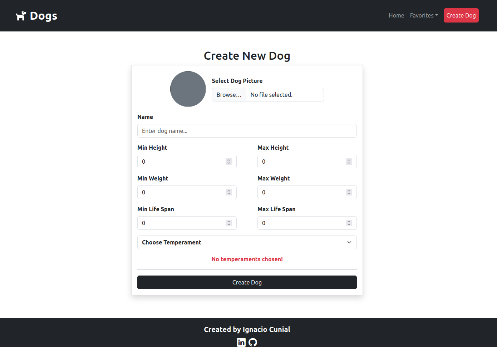
</td>
<td width="33%">
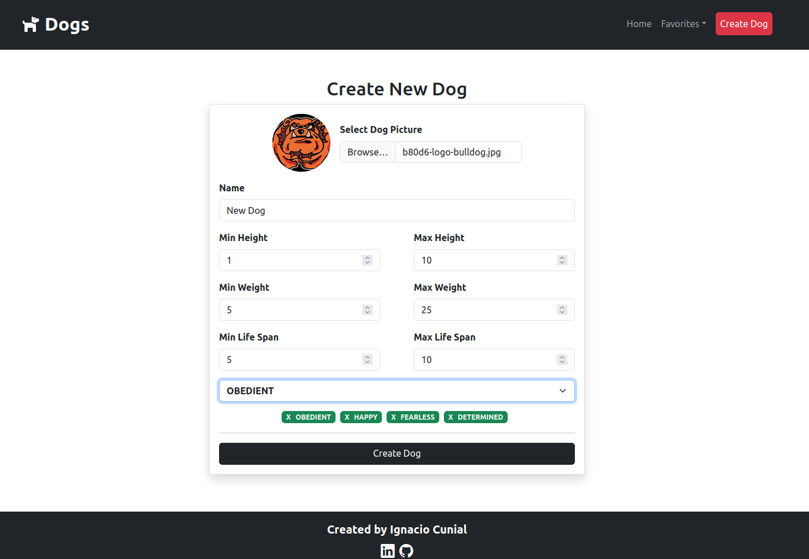
</td>
<td width="33%">
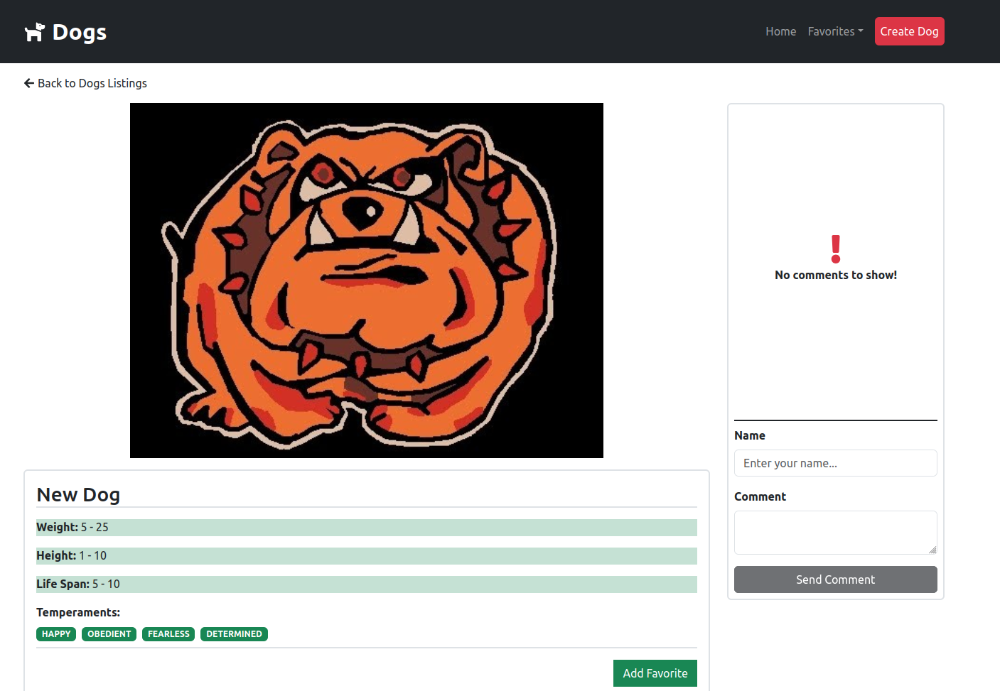
</td>
</tr>
<tr>
<td width="33%">
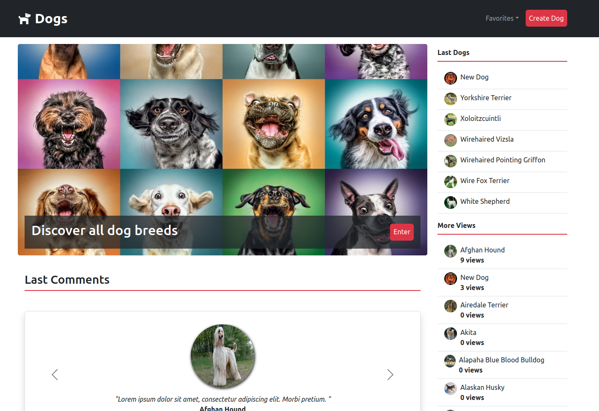
</td>
</tr>
</table>

### Technologies

Javascript - NodeJs - ExpressJs - Cloudinary - PostgreSQL - Sequelize - Jest - Supertest - React - Bootstrap

### Features

<ul>
<li>List Dogs</li>
<li>Filter dogs by name and temperament</li>
<li>Order dogs by name, height, weight and life span</li>
<li>Add and remove dogs from favorites</li>
<li>Comment on the dog's page</li>
<li>List last comments</li>
<li>List last dogs</li>
<li>List dogs with more views</li>
<li>Create new dogs</li>
<li>Update dog's images to Cloudinar</li>
</ul>

### More

<ul>
<li>Backend testing with Jest and Supertest</li>
</ul>
